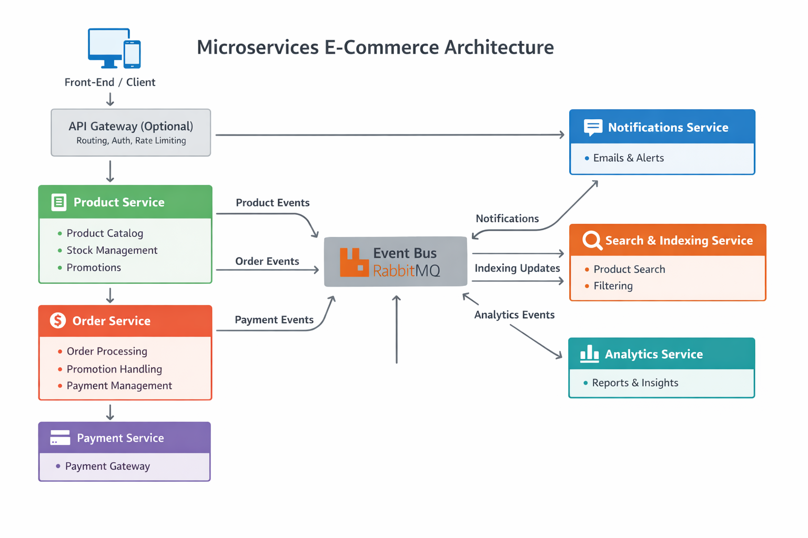

Perfect! Let’s visualize the entire microservices e-commerce platform with all services, event flows, and integrations. This will help cement the architecture in your mind and serve as a blueprint for scaling or deploying.

+---------------------+
|  Front-End / Client |
+---------+-----------+
          |
          v
+---------------------+
|   API Gateway       |
| (Optional, handles  |
| auth, routing, rate |
| limiting)           |
+---------+-----------+
          |
          v
+---------------------+
|   Product Service   |
|--------------------|
| - CRUD products     |
| - Categories/Tags   |
| - Stock management  |
| - Promotions        |
| - Event publisher   |
+---------------------+
          |
          v
      Publishes events
          |
          v
+---------------------+        +------------------------+
|  Order Service      | <----> | Payment Service / API  |
|-------------------- |        | - Processes payments  |
| - Order creation     |       +------------------------+
| - Stock validation   |
| - Promotions applied |
| - Publishes events   |
+---------------------+
          |
          v
  Publishes events
          |
          v
+----------------------+       +----------------------+
| Notifications Service |       | Search & Indexing    |
|----------------------|       | Service              |
| - Order updates      |       |----------------------|
| - Promotions         |       | - Maintains index    |
| - Stock updates      |       | - Filters/search     |
+----------------------+       +----------------------+
          |
          v
  Sends notifications (email, push, internal)
          |
          v
+---------------------+
| Analytics Service    |
|---------------------|
| - Order analytics    |
| - Revenue reports    |
| - Product trends     |
| - Promotion metrics  |
+---------------------+


Perfect! Let’s visualize the **entire microservices e-commerce platform** with all services, event flows, and integrations. This will help cement the architecture in your mind and serve as a blueprint for scaling or deploying.

---

# Complete E-Commerce Microservices Architecture

```
+---------------------+
|  Front-End / Client |
+---------+-----------+
          |
          v
+---------------------+
|   API Gateway       |
| (Optional, handles  |
| auth, routing, rate |
| limiting)           |
+---------+-----------+
          |
          v
+---------------------+
|   Product Service   |
|--------------------|
| - CRUD products     |
| - Categories/Tags   |
| - Stock management  |
| - Promotions        |
| - Event publisher   |
+---------------------+
          |
          v
      Publishes events
          |
          v
+---------------------+        +------------------------+
|  Order Service      | <----> | Payment Service / API  |
|-------------------- |        | - Processes payments  |
| - Order creation     |       +------------------------+
| - Stock validation   |
| - Promotions applied |
| - Publishes events   |
+---------------------+
          |
          v
  Publishes events
          |
          v
+----------------------+       +----------------------+
| Notifications Service |       | Search & Indexing    |
|----------------------|       | Service              |
| - Order updates      |       |----------------------|
| - Promotions         |       | - Maintains index    |
| - Stock updates      |       | - Filters/search     |
+----------------------+       +----------------------+
          |
          v
  Sends notifications (email, push, internal)
          |
          v
+---------------------+
| Analytics Service    |
|---------------------|
| - Order analytics    |
| - Revenue reports    |
| - Product trends     |
| - Promotion metrics  |
+---------------------+
```

---

## Event Flow Summary

1. **Product Service events**:

   * `product_created`, `product_updated`, `product_deleted` → Search Service, Analytics Service, Notifications Service
   * `product_stock_updated` → Notifications Service, Analytics Service

2. **Promotion events**:

   * `promotion_created`, `promotion_updated`, `promotion_deleted` → Search Service, Notifications Service, Analytics Service

3. **Order events**:

   * `order_created` → Notifications Service, Analytics Service
   * `order_paid` → Notifications Service, Analytics Service
   * `order_payment_failed` → Notifications Service, Analytics Service

4. **Checkout / Payment**:

   * Payment success/failure triggers `order_paid` / `order_payment_failed` events

---

## Key Architectural Principles

* **Event-driven architecture**: All services are decoupled via RabbitMQ (or another broker).
* **Microservices decomposition**:

  * Product Service → core product & stock logic
  * Order Service → order creation, stock validation, promotions, payments
  * Notifications Service → reacts to events, sends messages
  * Search & Indexing Service → maintains product search index
  * Analytics Service → business intelligence, reports
* **Domain-driven design**: Each service encapsulates its domain and publishes events
* **Scalability**: Each service can scale independently
* **Extensibility**: Adding new services (e.g., Shipping Service, Refund Service) only requires subscribing to relevant events

---

If you want, I can also create a **visual diagram with arrows and services in a modern “boxes and arrows” style** that you could use in documentation or presentations.

Do you want me to generate that **visual diagram**?
